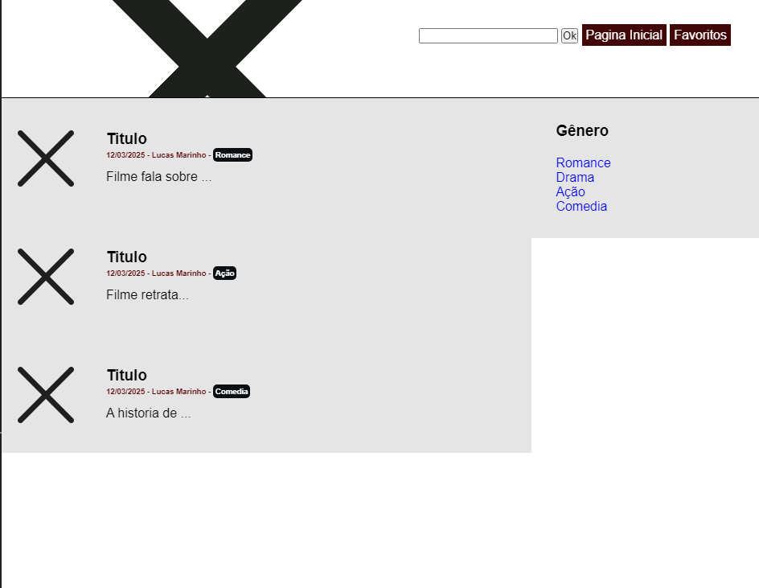
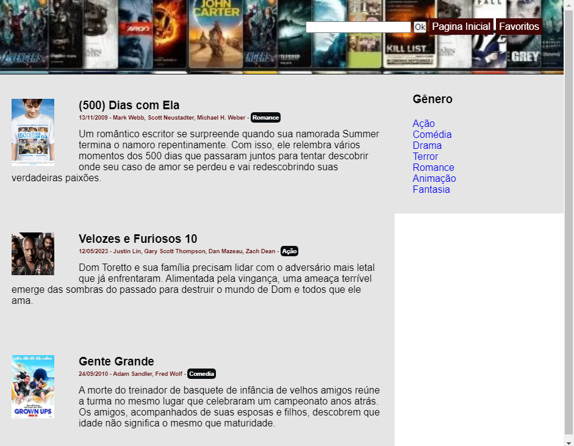

# Trabalho Prático - Semana 03

Dessa vez, vamos escolher uma proposta de projeto para trabalhar. Na [lista de propostas de projetos](propostas-projetos.md), escolha um dentre as alternativas.

Nessa atividade, você deverá montar a página inicial do projeto escolhido, a organização do HTML aplicando semântica correta e uso aprimorado do CSS. Leia o enunciado completo no Canvas para mais detalhes.

**IMPORTANTE:** Você deve trabalhar e alterar apenas arquivos dentro da pasta **`public`**. Deixe todos os demais arquivos e pastas desse repositório inalterados. **PRESTE MUITA ATENÇÃO NISSO.**

## Informações Gerais

- Nome:Lucas Marinho Blon Rocha
- Matricula:893436
- Proposta de projeto escolhida: Catálogo de Filmes
- Breve descrição sobre seu projeto:Paginha que permite a pesquisa pelo nome do filme;filtros como: ano, genero e autor; opção de favoritar filmes.
Na pagina inicial podemos ver os filmes,suas capas, um breve resumo,titulo, ano e autor
depois de entrar na pagina aparecerão mais informações sobre o filme 

## Print do esboço criada

## Print da home-page criada

